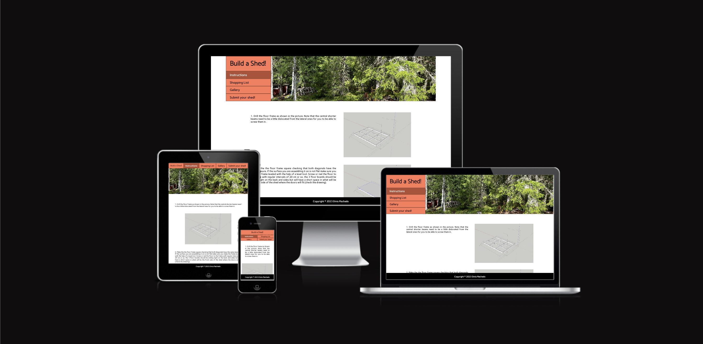

# Build a Shed!

Build a Shed is a webpage sharing instructions and planning to build a simple shed. It has an instructions page, a checklist for materials and tools, and a gallery and form where users can share their built projects.

Visit [Build a Shed](https://dinismachado87.github.io/buildashed-main/)

## Features

### Header

Featured at the top of all pages, there is a header that includes the hero image and navigation, which adapts to different screen sizes while preserving a landscape format and proportions of the hero image.

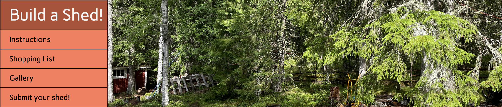

### Navigation

The navigation is included inside the header, and its elements are rearranged for different screen sizes between a horizontal line and two versions of a more vertical block to safeguard the proportions of the hero image.

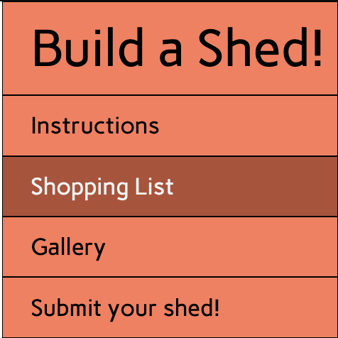

### Body

The body of the page has a margin around its elements to separate it from the marginless header. It was thought of as a table or surface where elements are displayed. Throughout the different pages, the elements assume different configurations adapting to the kind and number of content to be displayed.

### Build a Shed! (Welcome Message)

When clicking on the logo, the user is taken back to the welcome message, which is the index page. Here, a welcome message sets a personal and caring tone to the website. The page has one single block of text as if it were a paper letter.

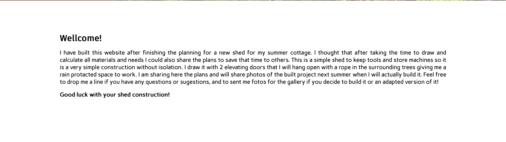

### Instructions

The instructions page includes a series of instructions on how to build the shed. Each instruction is contained within a block with an image and a text section that, depending on screen sizes, will be shown side by side or one after the other.

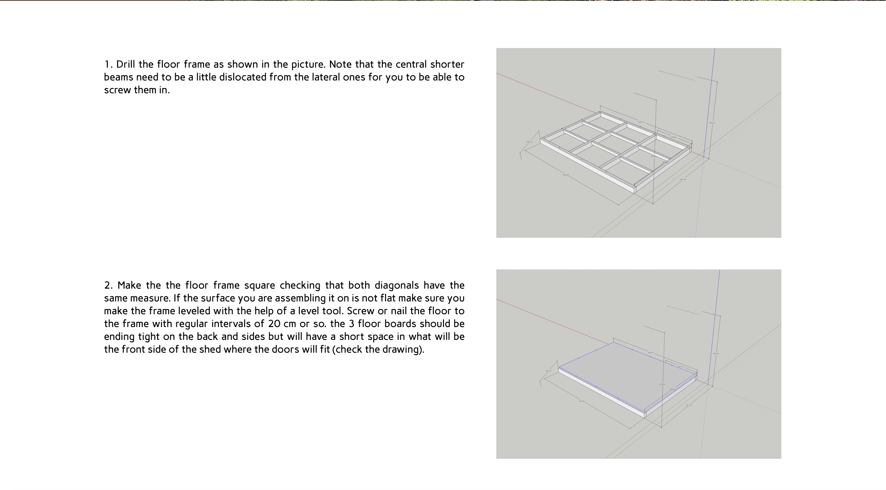

### Shopping List

The Shopping List page contains two boxes containing a series of lists of everything needed to realize the project. The boxes include a black margin resembling Post-it notes or paper with annotations. The boxes appear side by side on wider screens, preventing unnecessary scrolling, and one over the other on narrower screens to fit the available space without losing readability.

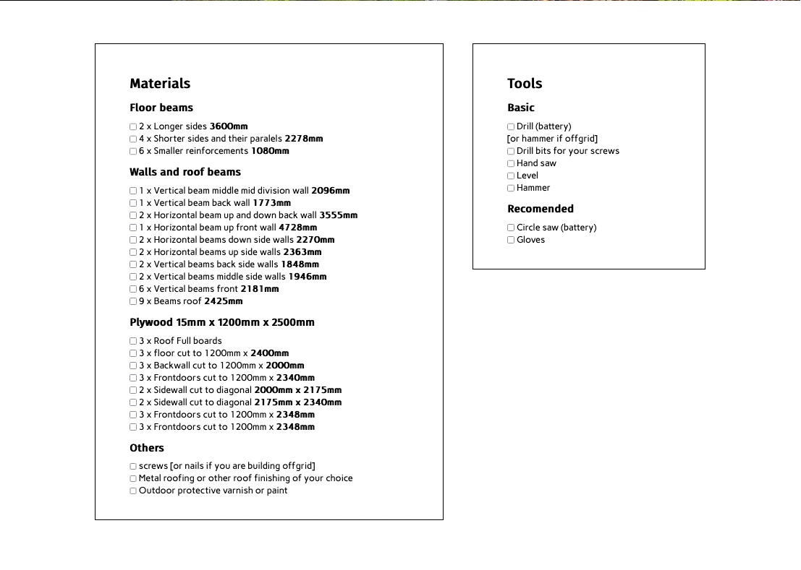

### Gallery

The Gallery Page hosts a series of images submitted by the users of built versions of the shed. The number of pictures per row in the gallery adapts through different screen sizes to fit the screen.

### Submit your Shed!
The Submit Your Shed page hosts a simple form for the users to submit photos of their built versions for the gallery, as well as comments and questions.

## Testing

I tested that the website works in different browsers: Chrome, Firefox, Safari.

I used devtools and [Am I Responsive tester](https://ui.dev/amiresponsive) to confirm that the website is responsive, looks, and functions as it is supposed to on all standard screen sizes.

I tested all the links and confirmed that all of them work and lead where they are supposed to lead.

## Bugs

* I encountered bugs in the adaptation of the navigation bar, mainly the appearance of white unformatted spaces in between divs at the breakpoints to different screen formats. I have discussed the issue with my mentor and CI tutors that sugested me to look into Kevin Powel's YouTube resources since this material was not yet in the course. After extensive research on these materials, it was clear to me that Flexbox would give me much more adaptability and I decided to rebuild the Navigation bar using Flexbox rather than floats and divs.

        #menu {
            font-size: 130%;
            background: #FF7A59;
            
            height: 300px;
            width: 300px;
            
            display: flex;
            flex-direction: column;
        }

        #menu a {
            text-decoration: none;
            color: black;
            border: 1px solid black;
            flex-grow: 1;
            overflow: hidden;
        }

        #menu div {
            display: flex;
            width: 100%;
            height: 100%;
            text-align: center;
            align-items: center;
            padding-left: 25px;
        }

        #menu div:hover {
            background-color: #B34E36;
            color: whitesmoke;
        }

        .nav_selected {
            background-color: #B34E36;
            color: whitesmoke;
        }

        #hero {
            display: flex;
            height: 300px;
            flex-basis: 900px;
            overflow: hidden;
            flex-grow: 1;
        }

        #hero img {
            width: 100%;
            object-fit: cover;
            flex-grow: 1;
            flex-basis: 100%;
        }

* I was encountering a bug in the instructions page where a small white column would appear in smaller media query. I realised that was due to the instructions image having a fixed width and resolved it changing the width to an adaptable 100%.

        .instruction_image {
        height: 180px;
        width: 100%;
        }

### Unsolved bugs

No unsolved bugs.

## Validator Testing

### HTML

No errors or warnings were found when passing through the official W3C validator.

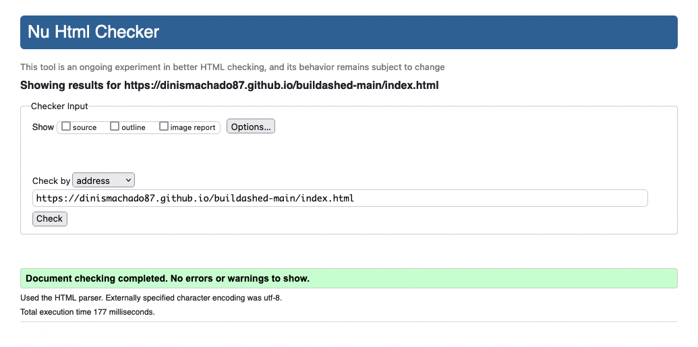
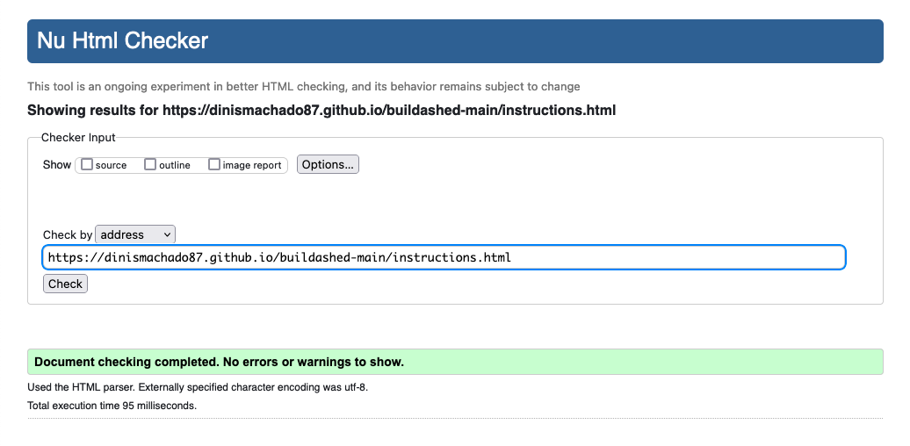
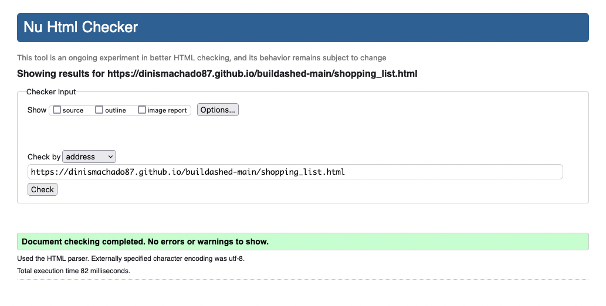

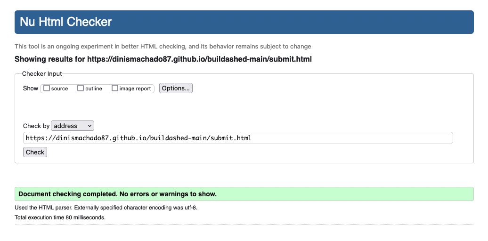

### CSS

No errors or warnings were found when passing through the official W3C (Jigsaw) validator.

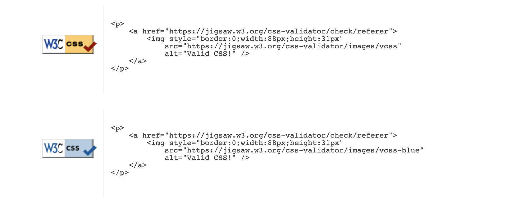

### Accessibility and Performance

Using Lighthouse in devtools, I confirmed that the website is performing well, and accessible, and the colors and fonts chosen are readable.

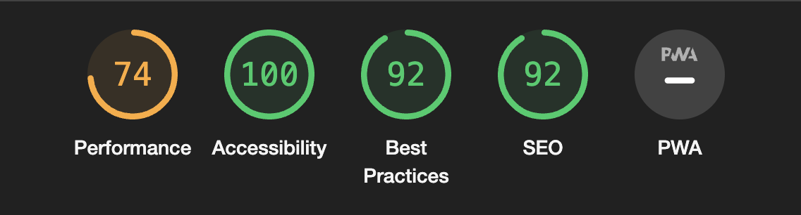

## Deployment

The website was deployed to GitHub pages and can be accessed by the link: [Build a Shed!](https://dinismachado87.github.io/buildashed-main/index.html)

## Credits

Gallery images taken from [Unsplash](https://unsplash.com/)

3D cottage simulation and instruction images are drawn by me in [SketchUp](https://www.sketchup.com/)

Input on Flexbox from the YouTube channel of [Kevin Powell](https://www.youtube.com/user/KepowOb)
