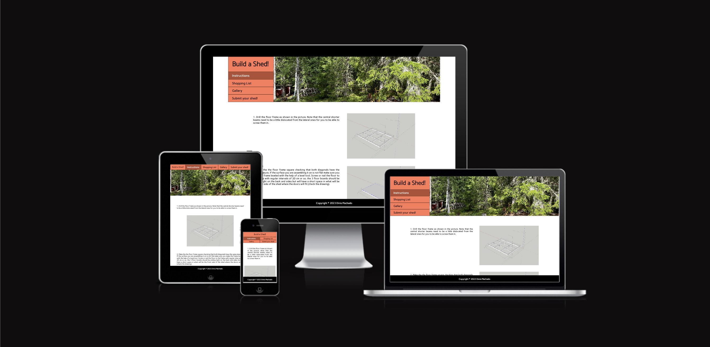
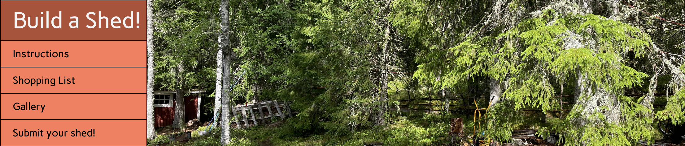
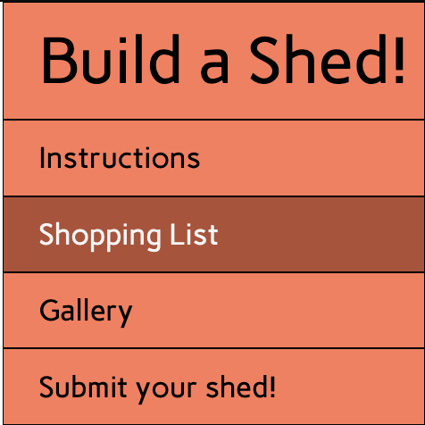
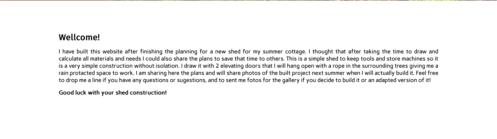
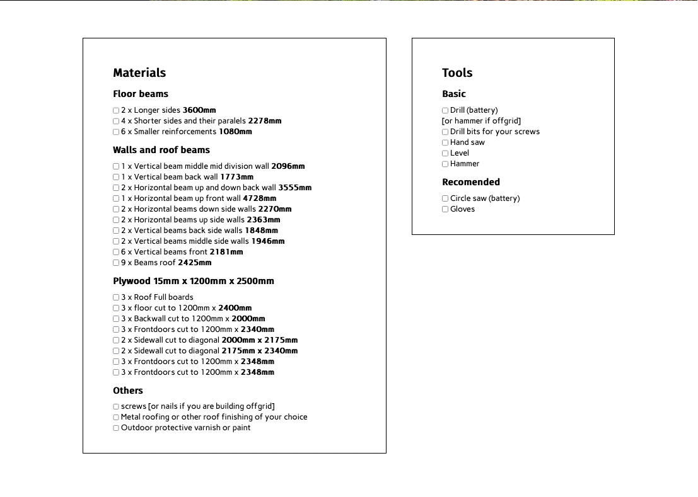
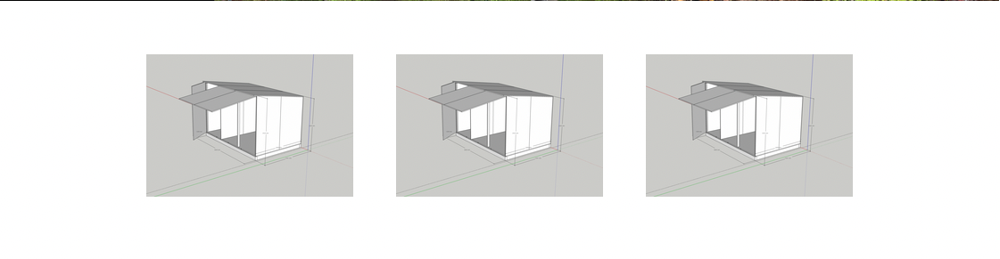
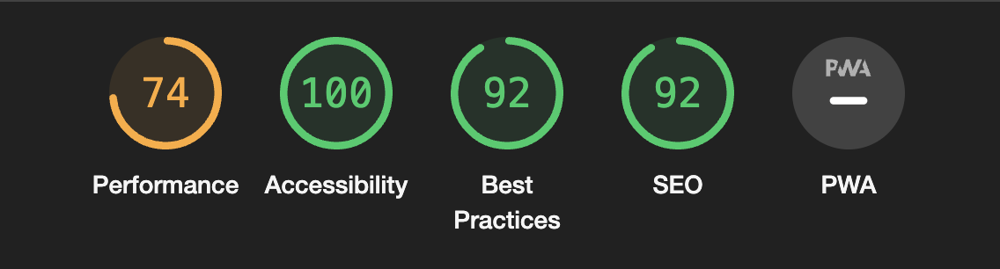

# Build a Shed!

Build a Shed is a page sharing instructions and planning to build a simple shed. It has an instructions page, check list for materials and tools and a gallery and form where users can share their built projects.

## Features

### HEADER

Featured at the top of all pages there is a header that icludes the hero image and navigation which adapt in the different constelations to fit diferent screens preservig a landscape format and proportions of the hero image.

### Navigation

The navigation is included inside of the header and their elements rearrage for diferent screen sizes in between a horizontal line and two vertions of a more vertical block to safegard the proportions of the hero image.

### Body

The Body of the page has a margin arround it's elements to separate it from the marginless header. It was thought as a table or surface where elements are displayed. Throughout the diferent pages the elements assume diferent configurations adaptint to the kind and number of content to be displayed.

### Build a Shed! (Welcome Message)

When clicking on the logo the used it taken back to the welcome message which is the index page. Here a welcome message sets a personal although carefull tone to the website. The page has one single block of text a if it was a paper letter.

### Instructions

The instructions page includes a series of intructions on how to build the shed. Each instruction is contained withing a block with an image and a text section that depending on screen sizes will be shown side by side or one after the other.

### Shopping List

The Shopping List page contains two boxes containing a series of lists of everything needed to realise the project. The boxes include a black margin resembling post it notes or a papper with anotations. The boxes appear side by side in wder screens preventing unnecessary scrolling and one over the other in narrower screens to fit the available space without loosing readability.

### Gallery

The Gallery Page hosts a series of images submited by the users of built formulations of the shed. The number of pictures per row in the gallery adapts through different screen sizes to fit the screen.

### Submit your Shed!

The Submit your shed page Hosts a simple for for the users to submit fotos of their built versions for the gallery as well as comments and questions.

## Testing

I tested that the website works in different browsers: Chrome, Firefox, Safari.
   
I used devtools and [Am I Responsive tester](https://ui.dev/amiresponsive) to confirm that the website is responsive, looks and functions as it supposed to on all standard screen sizes.
   
I tested all the links and confirmed that all of them work and lead where they suppose to lead.

## Bugs

I have encountered bugs of adaptation of the navigation bar to diferent screen formats and have run several series of code editing and testing to solve them.

### unsolved bugs

no unsolved bugs

## Validator Testing

### HTML

No errors or warnings were found when passing through the official W3C validator.

### CSS

No errors or warnings were found when passing through the official W3C (Jigsaw) validator.

### Accessibility and performance

Using lighthouse in devtools I confirmed that the website is performing well, accessible and colors and fonts chosen are readable.

## Deployment

The website was deployed to GitHub pages and can be accessed by the link: [Build a Shed!](https://dinismachado87.github.io/buildashed-main/index.html)

## Credits

Gallery images taken from [unsplash](https://unsplash.com/)

3D cottage simulation and instruction images drawn by me in [SketcUp](https://www.sketchup.com/)

Input on Flexbox from the youtube chanel of [Kevin Powell](https://www.youtube.com/user/KepowOb)